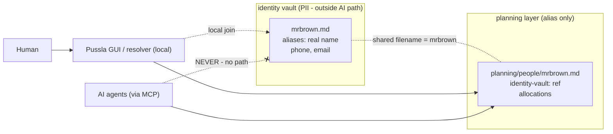

# Design Choice: Identity-Vault Separation (identity-shield pattern)

## Status
**Proposed** — recommendation: Option B. Awaiting decision.

## Context
[ADR-001](adr-001-person-centric-vs-project-centric.md) stores planning per person, and [ADR-003](adr-003-alias-design.md) establishes that aliases are the only identifiers used in `/planning/`, with the alias→real-name mapping confined to an `/identity/` directory that is the "source of truth" for re-identification.

What ADR-003 leaves open is **where that identity store physically lives and how Pussla reaches it** — because Pussla is not the only consumer. The same person data is already handled in Obsidian via the `identity-shield` project (see that repo's ADR-001), and future tools may want to read the same planning data too. We want one coherent pattern across all of them rather than each tool reinventing PII handling.

This is a concrete instance of a reusable design pattern ("identity-shield pattern"): two layers keyed by a shared filename (the alias), where the identity layer sits physically outside any AI/agent path, and only local (non-agent) code ever joins the two.

### The core invariant
- The alias (filename) is the **only** key shared between the two layers.
- The identity layer is **physically outside** every agent's reachable path — protection is *absence of a path*, not a filter that can be misconfigured.
- The planning layer carries **zero PII and no pointer back to a person**.
- Only local, non-agent code may read both layers (the GUI's local join from ADR-003).

> Leak rule: `identity-vault: <vault-name>` (naming *which* store) is fine; `identity-path: Karl Larsson` (naming *the person*) is a leak. Even an indirect pointer to the individual counts.

## Decision
Adopt the identity-shield pattern explicitly, and decide the location of the identity store:

### Option A — Internal `/identity/` folder (self-contained)
The `/identity/` directory lives inside the Pussla repo, as ADR-003 currently implies. Pussla works standalone with no external dependency.
- ➖ If the same people also live in a separate Obsidian identity vault, their real names now exist in **two** places → sync burden and a doubled leak surface.

### Option B — External/configurable identity vault (single source of truth) — *recommended*
Pussla is pointed at **two locations**: an identity vault and a planning vault — much like Obsidian works today. The identity vault may be an existing store (e.g. the `identity-shield` identity vault) or any folder. Pussla itself then holds **no PII at all**: it only ever stores aliases in `/planning/`, and a local resolver joins against the configured identity vault for human display.
- ➕ Real names live in exactly one place; Pussla never becomes a PII store.
- ➕ Multiple apps (Obsidian, Pussla, future tools) share the same identity source.
- ➖ Pussla depends on a configured identity vault to show real names (falls back to aliases without it).

AI/agent access (via the MCP server) is pointed **only** at the planning vault in both options. The identity vault path is never exposed to agent tools.

## Rationale
1. **Single source of truth for PII** (B) minimizes the number of places a real name can leak or drift out of sync — the primary privacy goal.
2. **One pattern across tools.** Reusing the same alias-as-filename + physical separation that `identity-shield` already runs in Obsidian avoids inventing a second, subtly different scheme.
3. **Protection by absence of path**, not by filter, keeps the guarantee robust even if MCP/agent config changes.
4. Consistent with ADR-003's local-join re-identification flow — this ADR only pins down *where* the identity side of that join lives.

## Consequences
- Pussla gains an **identity-vault path** as configuration (alongside the planning vault). Under B, absent that config, Pussla shows aliases only — a safe default.
- The MCP server must be verified to have **no route** to the identity vault; add a test/check (cf. the `pii-check` scanner) that fails if any `/planning/` file contains a person-pointer.
- ADR-003's `/identity/` remains valid as the *interface*; this ADR makes its location configurable and clarifies it may be shared/external.
- The pattern is documented for cross-project reuse (Obsidian note: "identity-shield pattern").

## References
- [ADR-001 — Person-centric vs project-centric storage](adr-001-person-centric-vs-project-centric.md)
- [ADR-003 — Alias design](adr-003-alias-design.md)
- `identity-shield` repo, ADR-001 (Obsidian implementation of the same pattern)
